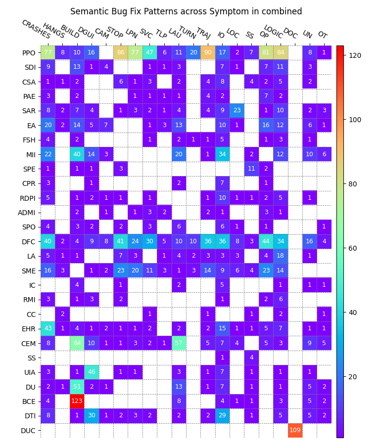
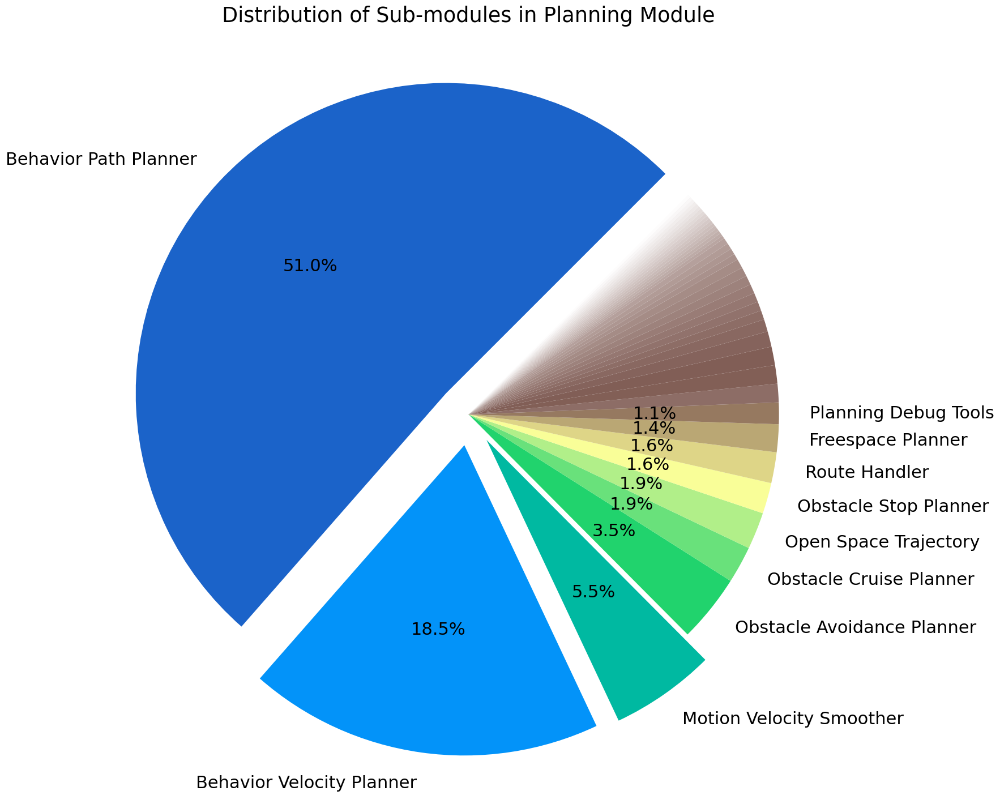
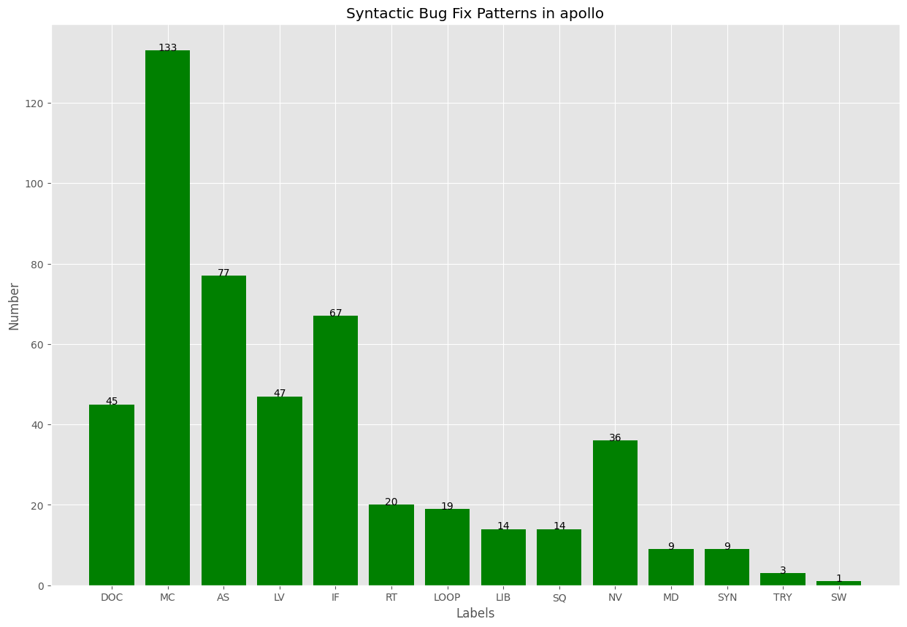
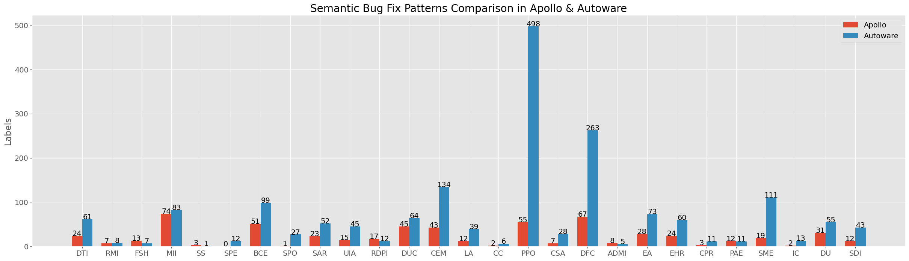
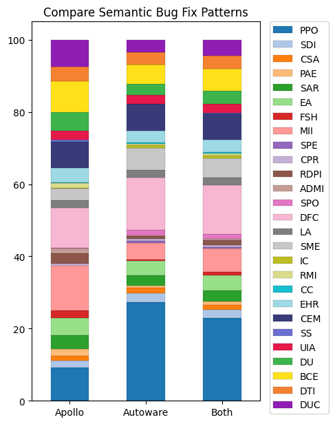

# Artifacts of the ADS Bug-Fix Pattern Study


## Introduction

This is the first bug-fix pattern study in the ADS domain. Our proposed hierarchical classification of ADS bug-fix pattern study includes 15 syntactic and 27 semantic bug-fix patterns, as well as root causes, symptoms, modules, sub-modules, related algorithms, and detailed bug-fix actions. This taxonomy is instrumental for developers, testers, and researchers in developing automated bug detection and repair tools for ADS.

The **published paper** (currently unreleased) of this ADS Bug-Fix Pattern Study will be available at [ACM FSE 2025](https://doi.org/10.1145/3715733). Now you can access the **pre-print version** of this paper at [Arxiv](https://arxiv.org/abs/xxx).

The **artifacts** of this project are also available at [](https://doi.org/10.5281/zenodo.14776291)


## Directory Structure

```
|--DIR_ROOT
    |--data
        |--bfp_label
            |--csv
            |--json
        |--bug-fix file-change dataset
            |--ApolloAuto_apollo
            |--autowarefoundation_autoware
            |--autowarefoundation_autoware.universe
            |--pr_files.json
    |--figs
```

## Usage

- `data/bfp_label` contains the labeled data of pull requests from Apollo and Autoware GitHub repositories in two formats. 
- `data/bug-fix file-change dataset` contains the bug-fix code changes of pull requests. 
- `figs` contains the output figures generated by data analysis and data visualization.

## Figure Analysis Examples

### Heatmap


### Pie


### Bar


### Comparison Bar


### Stacked Bar



## Paper Citation

This paper is accepted by FSE 2025, which is not published yet. Currently, we provide an Arxiv version of this paper. We will update the paper citation once it is published.

If you use the data or code in this repository, please cite the following paper:

```aiignore
xxx
```